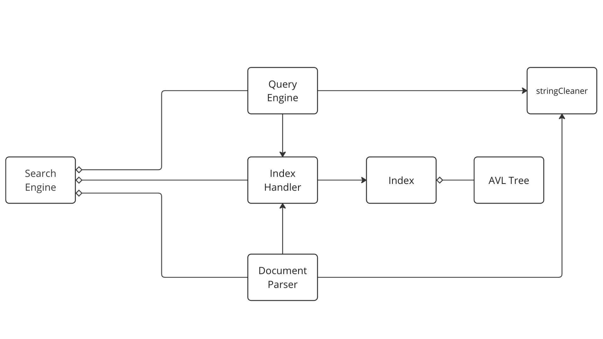

# Assignment 4: Answers

**Complete this document, commit your changes to Github and submit the repository URL to Canvas.** Keep your answers short and precise.

**Names of all team members:** 
* Emma Seba Sharp (49001529)
* Hamna Tameez (48971109)
* Zareenah Murad (48908059)

Used free extension: [ ] 24 hrs or [ ] 48 hrs

[x] Early submission (48 hrs)

[x] Bonus work. Describe: The AVL-tree remove, removeNode, and removeNodeHelper functions (Professor Hahsler said this would be considered a bonus). These node removal functions work together to remove a node while maintaining balance and accurately manage worst case removal scenarios. For example, if a successor node is not the immediate child of the node to be deleted, and the successor has a right subtree that must be preserved. 

Place [x] for what applies.

## Answers

### Project Management

Complete the tasks and planned completion columns **BEFORE** You start with 
coding!

Weekly milestones/tasks. Set out a plan at the beginning and then record when you got it done.

| Task                          | Planned completion | Actual completion |      Hrs by Hamna      |     Hrs by Zareenah    |      Hrs by Emma       |
| ----------------------------- | :-----------------:| :---------------: | :--------------------: | :--------------------: | :--------------------: |
| UML Diagram                   |        Nov 3       |       Nov 5       |         4.5            |          4.5           |          4.5           |
| AVL Tree (Zareenah)           |        Nov 8       |       Nov 8       |                        |          10.5          |                        |
| AVL Tree Tests (Zareenah)     |        Nov 8       |       Nov 8       |                        |          3             |                        |
<<<<<<< HEAD
| stringCleaner(Emma)           |        Nov 26      |       Nov 7       |                        |          0.5           |          6             |
| Document Parser (Hamna)       |        Nov 15      |       Nov 14      |          9             |          0.5           |                        |
| Index Handler(Emma)           |        Nov 15      |       Nov 20      |                        |                        |          15            |
| Index(Emma)                   |        Nov 19      |       Nov 12      |                        |                        |          0.5           |
| Search Engine (Everyone)      |        Nov 22      |       Nov 29      |          12            |          0.25          |          4             |
=======
| stringCleaner(Emma)           |        Nov 26      |       Nov 7       |                        |          0.5           |          5.5           |
| Document Parser (Hamna)       |        Nov 15      |       Nov 14      |          9             |          0.5           |                        |
| Index Handler(Emma)           |        Nov 15      |       Nov 20      |                        |                        |          15            |
| Index(Emma)                   |        Nov 19      |       Nov 12      |                        |                        |          0.5           |
| Search Engine (Everyone)      |        Nov 22      |       Nov 29      |          12            |          0.25          |          1.25          |
>>>>>>> 4242b69ac8769c011ff0746626d1dba0339129dd
| Query Processor (Zareenah)    |        Nov 22      |       Nov 27      |                        |          14.5          |                        |
| Query Processor Tests (Zareenah) |     Nov 29      |       Nov 29      |                        |          2             |                        |
| Persistence (Emma)            |        Nov 26      |       Nov 26      |                        |                        |          4.7           |
| Documentation File (Everyone) |        Nov 28      |       Nov 29      |                        |          3.5           |                        |

## High-level Design of Solution

This Search Engine project was created by Emma Seba Sharp, Hamna Tameez, and Zareenah Murad for CS 2341 - Data Structures. The program indexes 300,000+ .json files (financial documents from Kaggle) using a custom AVL-Tree. The user can enter a search query and will receive at most 15 document results in order of relevancy. The search engine supports searching for multiple words, excluding a word, and searching for specific people and organizations. 

## Components

### Search Engine:

The Search Engine serves as the user interface and a connection across Document Parser, Index Handler, and Query Processor. Its private member variables include pointers to docParser, a Document Parser object, indHandler, an Index Handler object, and queryProc, a Query Processor Object. go()takes in command line arguments and uses them to determine whether to perform indexing, querying, or starting up the menu using printMenu() from SearchEngine. If "index" is specified, it utilizes the testFileSystem() function from the docParser to parse JSON files in a given folder. Then, it invokes the serialize function of queryProc to persist the index data into separate text files. If "query" is specified, it reads the previously generated index files using deserialize and processes a user-supplied query through the processQuery() function. The results, consisting of document titles and associated URLs, are displayed with an option to view the corresponding articles. Additionally, printMenu()offers various functionalities such as building an index from JSON files, creating an index from custom text files, searching for queries, printing search engine statistics, and exiting the menu. The user is guided through these options with prompts and interactive inputs. The Search Engine provides a comprehensive and user-friendly interface for indexing and querying.

### String Cleaner:

The string cleaner is a helper class for the query processor and document parser classes. It is passed a string and cleans it up to make it easier to store it in the AVL tree and be used for querying. The string cleaner converts the string to lowercase and removes punctuation, except hyphens and underscores. Next it reads in each word from the string and checks if the word is in the stop words list. If it is, the word is ignored. If it is not, the word is stemmed and added to a vector that is returned to the class that called the string cleaner function.

### Query Processor:
The Query Processor handles processing user queries and works alongside an IndexHandler to support serialization and deserialization and data retrieval. Upon receiving a user query, the Query Processor initiates processing by cleaning and parsing the query. It determines the relevant index (AVL-tree) for each word of the query based on its prefix. Then, the Query Processor retrieves the results (stored as a map of document IDs and frequencies) for each word using the Index Handler’s getDocument() function. The results for each word of the query are accumulated in a vector and the Query Processor then manually finds the intersection between the result maps of each word. This manual intersection ensures that only the document IDs, and not the frequencies of words, are compared. Further, manual intersection allows the Query Processor to accumulate a sum of the frequencies of words in a query which is used later to rank the results. Next, the Query Processor removes the results associated with words (if any) that the user wanted to exclude from the query. Finally, the results are ranked according to frequency and document information (title and filepath) is retrieved using the Index Handler’s retrieveFilepath() function. The finalized ranked results are then passed to the User Interface to be printed for the user. 

### Index Handler:
The Index handler manages the communication with the index which contains the three AVL trees. It performs the following functionality:
Insertion(insert2Tree()): Has 5 parameters: Tree name, File ID, List of words to be inserted, Article title, and Article file path. The function inserts the title, id, and file path to a map to be used during querying.  It checks which tree the words are being inserted into and loops through the list of words. During the loop, the word is read from the list of words and stored in a variable named keyword. A pair is made with the document id and the relative word frequency. Finally, the insert function of the AVL tree is called to add the data to the specified tree.
Retrieval from the AVL tree(getDocuments()): Has 2 parameters: Tree name and word. The tree name specifies which tree must be searched, then the get function of the AVL tree is called to search the tree for the word. It returns a pointer to the location of the value set map.
Retrieval of the article title and file path from the map(retrieveFilePath()): uses the id to search the titleFilePath map and returns a pair that contains the title and file path of the article.
Persistence(serialize() and deserialize()): Has 4 parameters; input/ output paths for the three AVL trees (words, people, orgs) and the title and file path map in index handler. For serialization, the persistence function of each AVL tree is called and the map is looped through and written in the document. For deserialization, the key and values for each node are read in, then the AVL tree insert function is called to insert them into the tree. The map file is read and the strings are stored in the map.
Returning the size(getWordsTreeSize() and getFilePathSize()): retrieves the size of the words AVL tree and title file path map.

### Document Parser:
The Document Parser reads in the json files and extracts necessary data from them.The class utilizes an IndexHandler object for efficient indexing and storage of parsed information. It extracts information from the files by using two functions: readDocuments() and testFileSystem(). testFileSystem() takes in a filepath and iterates through each directory at that filepath and recursively goes through all the folders and subfolders until it finds a regular file that ends with .json. It then calls readDocuments() and passes in the filepath of a .json file. readDocuments() declares three maps, words, orgs, and people, with the key being a string representing the title/word/org/person and the value being a float representing the relevancy ratio of the title/word/org/person. The function also reads a specified JSON file, extracting relevant data such as text, title, URL, and UUID using an IStreamWrapper object. It then uses a StringCleaner object to preprocess the text, removing any unwanted characters or formatting. Subsequently, the function analyzes word frequencies within the cleaned text and updates the words map accordingly. Additionally, it identifies and processes entities such as persons and organizations, converting their names to lowercase and calculating their respective frequencies in the text. These entities and their frequencies are stored in separate maps. Finally, the data, including words, persons, and organizations, is inserted into an AVL tree using the IndexHandler. Overall, the DocumentParser facilitates the extraction, cleaning, and indexing of information from JSON documents so that the information can be used by IndexHandler.

### AVL-Tree:
This custom AVL-Tree implementation is an adaptation from Professor Michael Hahsler’s CS 2341 Github repository that was modified to use a map to store values. The tree supports having an std::string as a key and stores a pair of values (std::string, float) in a std::map called valueMap. In this context, the ‘key’ represents a word and the ‘value’ is a pair consisting of a document ID and the relative frequency of the word in the document. This AVL-Tree supports serialization and deserialization into a file, allowing for persistence of the index. The user can choose whether to build a new index or utilize an existing one. Insertion and Deletion into this AVL-Tree is O(log n) time where n represents the number of nodes in the tree. Because a word can be found in multiple documents, we used a std::map to store multiple pairs of values. For insertion, we had to consider different scenarios, like creating a brand new node for a new word, versus updating an already existing node’s valueMap with additional value pairs. When inserting a new word node, a new valueMap is created with that word’s value pair in the map. However, when inserting a word that already exists in the tree, the valueMap is simply updated, and that word’s value pair is added to the already existing valueMap. In terms of removal, the remove(), removeNode(), and removeNodeHelper()functions all work together to remove a node. The remove() function is the entry point for deletion. It takes in a specific key and value pair to be deleted and then calls removeNode() to handle the node removal. This function considers three potential cases: if the node to be deleted has zero, one, or two children. If the node has no children, the node is simply deleted. If the node has one child, the node is replaced by its child. If the node has two children, the removeNodeHelper() function is called in order to find the leftmost node of the right subtree (the smallest node). The removeNodeHelper() function works by recursively exploring to the left of the right child until finding the leftmost node of the right subtree. Then, it copies the key and valueMap of that leftmost (smallest) node to the original node’s location and replaces the node with its right child. The removal functions ensure that the balance and integrity of the AVL-tree are preserved and accurately manage worst case scenarios. For example, when dealing with a successor node that is not the immediate child of the node to be deleted, and the successor has a right subtree that must be preserved. 

## Used Data Structures

### Custom AVL Tree: 
*Usage:* The Document Parser and Index Handler work together to create 3 trees (words, people, and organizations). The Query Processor of the search engine then searches these custom AVL-trees when it receives user input. 

*Time and space complexity:* insertion and deletion into the tree are O(log N) and the space complexity is O(N) where N is the number of nodes

*Why it’s appropriate:* The AVL Tree is self-balancing and maintains efficient search, insertion, and deletion with a time complexity of O(log N). The nodes of the tree use a map in order to associate multiple values (document IDs and relative frequencies) with a single key (word). The AVL Tree uses dynamic memory allocation for nodes for memory efficiency and follows the Rule of Three, ensuring proper memory management. The tree also supports persistence, allowing the index to be stored in a file. 

*Alternate data structure:* a hash table - this would have provided an average constant O(1) time complexity for search, insertion, and deletion

### std::map: 
*Usage:* A map is used as a container to implement the custom AVL-tree. It associates a document ID (key) with the relative frequency of a word (value). A map is used in Document Parser to associate words, people, and organizations (key) with their corresponding frequencies (value) in a document. Query Processor uses an unordered map to associate a document ID (key) with its accumulated frequency (value). 

*Time and space complexity:* In an std::map, insertion, deletion, and search operations have an average time complexity of O(log N). In an std::unordered_map, insertion, deletion, and search operations have an average time complexity of O(1). The space complexity is O(N) depending on the size of the map. 

*Why it’s appropriate:* A map is appropriate for the AVL-Tree because it allows for associating multiple document IDs and their frequencies with a single word. A map is appropriate in the other scenarios because it provides relatively efficient search operations and allows for associating things like document ID and frequency in a straightforward manner. 

*Alternate data structure:* A trie could lend for more memory efficiency and faster operations depending on prefixes. 

### std::pair: 
*Usage:* Used by the custom AVL-Tree to store information associated with a word (the document ID and relative frequency of the word). 

*Time and space complexity:* Insertion, Deletion, and Search operations are O(log N) on average. The space complexity is the sum of the space complexity of each element of the pair. 

*Why it’s appropriate:* We had two pieces of information (document ID and frequency) to store, so an std::pair was the most straightforward and convenient data structure. 

*Alternate data structure:* We could have used a custom struct or class. 

### std::vector: 
*Usage:* String Cleaner uses a vector to store the list of stop words and to store the final cleaned and parsed string. The Query Processor uses vectors for: storing result maps for each word in a query, storing words to be excluded from the query, and storing the ranked results of a query. 

*Time and space complexity:* Accessing and appending an element to the end of a vector has a time complexity of O(1), and resizing (if capacity is reached) is O(N) on average. The space complexity is O(N), where N is the number of elements in the vector. 

*Why it’s appropriate:* Because of dynamic resizing, random access time complexity, and the wide array of data types it can store. Dynamic resizing is helpful because the size of the data is not known beforehand, random access has constant time complexity which allows for efficiency, and the versatility of data types that a vector can store makes it appropriate in multiple contexts.

*Alternate data structure:* We could have used a std::list, however because we do not know the size beforehand, a vector is the better option.

## User Documentation

Begin by compiling and running the program with the supersearch executable.

**make supersearch**

Enter one of the following command line arguments:

**./supersearch index <our test data path>**
**./supersearch query <our test queries>**
**./supersearch ui**

After opening the user interface, select one of the options from the main menu by entering a number. When entering a query, in order to find documents with a particular person or organization, precede the word with ‘PERSON:’ or ‘ORG:’. Make sure that there are no spaces before or after the colon. In order to find a person using their full name, you must put an underscore between their first and last name. In order to exclude a word, precede it with a minus sign.

### Example Queries:
**social network**

*Returns document containing the words ‘social’ and ‘network’*

**social -network**

*Returns documents containing ‘social’ and not ‘network’*

**social network PERSON:Mark_Zuckerberg**

*Returns documents containing ‘social’, ‘network’, and the person ‘Mark Zuckerberg’*

**social network ORG:facebook**

*Returns documents containing ‘social’, ‘network’, and the organization ‘Facebook’*

**social network PERSON:Mark -ORG:Facebook**

*Returns documents containing ‘social’, ‘network’, and the person ‘Mark’, but not the organization ‘Facebook’*

## Performance

TEST QUERY: *assist market*

------------------------------------------------------

**Performance statistics for 10 .json files:**

Time taken to build the index: 31,493 microseconds

Total # of words in the index: 1,164 words

Time taken to search for a query: 157 microseconds 

------------------------------------------------------

**Performance statistics for 100 .json files:**

Time taken to build the index: 264,649 microseconds

Total # of words in the index: 4,329 words

Time taken to search for a query: 316 microseconds 

------------------------------------------------------

**Performance statistics for 1000 .json files:**

Time taken to build the index: 4,094,271 microseconds

Total # of words in the index: 15,043 words

Time taken to search for a query: 1,898 microseconds 

------------------------------------------------------

**NOTE:** we were unable to test with the full dataset due to computer constraints 😟 

## Bonus Work
The AVL-tree remove, removeNode, and removeNodeHelper functions (Professor Hahsler said this would be considered a bonus). These node removal functions work together to remove a node while maintaining balance and accurately manage worst case removal scenarios. For example, if a successor node is not the immediate child of the node to be deleted, and the successor has a right subtree that must be preserved. 
  
